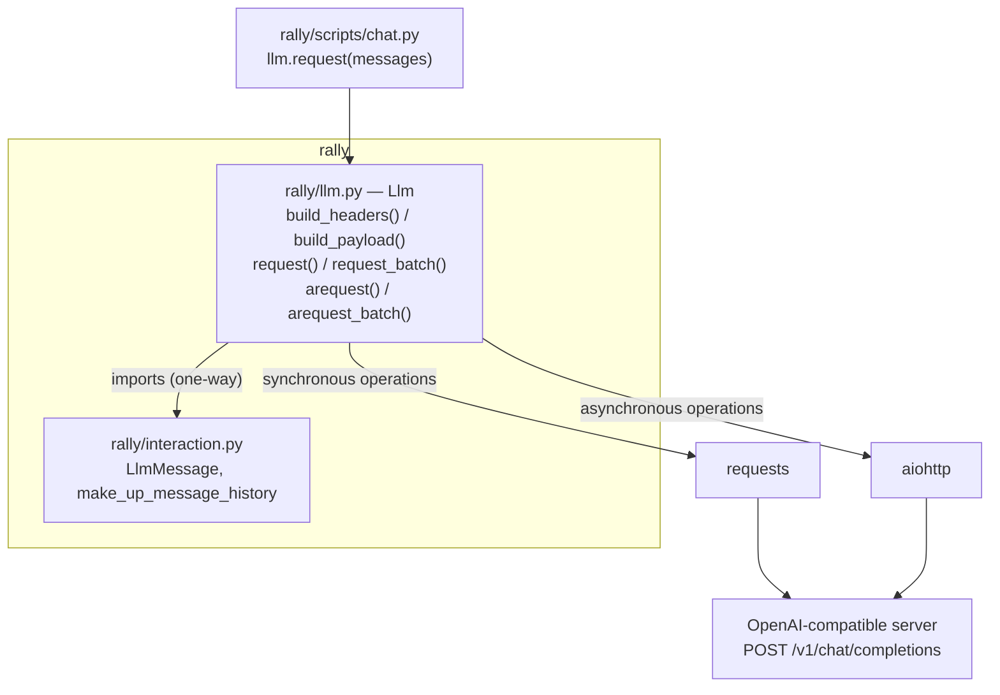

## Spec 03 — Request object (Llm-owned request construction)

### 1. Requirement analysis

#### 1.1 Motivation

rally constructs the same chat-completion HTTP request in several places: the synchronous single-request operation, the asynchronous single-request operation, and every caller that passes the connection and generation fields (`llm_server_url`, `authorization`, `model`, `max_output_tokens`, `enable_thinking`, `max_concurrent_requests`) by hand. Headers and body are therefore assembled independently in each place, and each new generation parameter has to be threaded through all of them. The gap this spec closes is the absence of a single owner for chat-completion requests: the `Llm` object becomes that owner — it describes the request (headers and body) and performs the request operations — and the module-level request functions disappear.

#### 1.2 Functional requirements

- **FR1 — `Llm` constructs the request headers.** `Llm.build_headers() -> dict[str, str]` returns `{"Content-Type": "application/json"}` and adds `{"Authorization": <authorization>}` when `Llm.authorization` is not `None`.
- **FR2 — `Llm` constructs the request body.** `Llm.build_payload(message_history) -> dict` returns `{"messages": <message_history>}` plus `"model"` when `Llm.model` is not `None`, both `"max_completion_tokens"` and `"max_tokens"` when `Llm.max_output_tokens` is not `None`, and `"chat_template_kwargs": {"enable_thinking": <value>}` when `Llm.enable_thinking` is not `None`. No other keys are added.
- **FR3 — `Llm` performs the request operations.** Four methods, implemented in `rally/llm.py`, each constructing its request exclusively through `build_headers()` and `build_payload()`:
  - `request(message_history) -> Optional[LlmMessage]` — synchronous single request (transport: `requests`).
  - `arequest(message_history) -> Optional[LlmMessage]` — asynchronous single request (transport: `aiohttp`).
  - `request_batch(system_prompt, user_prompts, progress_title=None) -> list[Optional[str]]` — synchronous batch, returning the response contents in prompt order; progress is reported through `logging` (a start and a completion message at INFO, one message per completed prompt at DEBUG), and nothing is logged when `progress_title` is `None`.
  - `arequest_batch(system_prompt, user_prompts, progress_title=None) -> list[Optional[str]]` — asynchronous batch, returning contents in prompt order, with the aiohttp connector limit set to `Llm.max_concurrent_requests`.
- **FR4 — `enable_thinking is None` omits the key on every operation.** When `Llm.enable_thinking` is `None`, no operation sends `chat_template_kwargs` at all. (The asynchronous operation currently sends `{"enable_thinking": false}` in that case, contradicting spec 01 and the test written for it; this spec unifies the behaviour on omission.)
- **FR5 — The module-level request functions cease to exist.** `request_based_on_message_history`, `request_based_on_prompts`, `_request_based_on_prompts`, `_single_request`, `_single_request_based_on_message_history` and `_single_request_based_on_message_history_via_aiohttp` are removed from `rally/interaction.py`, which keeps only `LlmMessage` and `make_up_message_history`; `rally/llm.py` imports them from there (one-way, no import cycle).
- **FR6 — rally's executable script calls the method on the `Llm` it already holds.** `rally/scripts/chat.py` calls `llm.request(messages)` and no longer passes `llm_server_url`, `authorization`, `model`, `max_output_tokens` or `enable_thinking`.

#### 1.3 Non-functional requirements

- **NFR1 — Wire compatibility.** For any `Llm`, headers and body produced by every operation are identical to those produced today for the same configuration, with two intended exceptions, both confined to the asynchronous operations: `Llm.enable_thinking` being `None` no longer sends `chat_template_kwargs` (FR4), and `Llm.max_output_tokens` being set now also sends `max_tokens` alongside `max_completion_tokens` (FR2). The transport split is preserved: synchronous operations keep using `requests`, asynchronous ones `aiohttp` — only the request description is unified. Header unification is wire-neutral: the asynchronous operations send no `Content-Type` themselves today because aiohttp's JSON payload supplies it, and an explicitly supplied header takes precedence over the payload's.
- **NFR2 — No new runtime dependency.** Only the standard library, `requests` and `aiohttp` are used.
- **NFR3 — The full test suite runs in the project virtual environment without installing additional packages**, in particular the asynchronous tests, which currently do not execute at all.
- **NFR4 — Linters pass** (black, isort, pylint, mypy) and public functions stay fully type-annotated.
- **NFR5 — The signature change is breaking by design.** Every call site inside `rally` is updated in this spec, so `rally`'s own suite passes. Call sites in other repos that use the removed functions are out of this spec's scope and stay broken until their own follow-up specs update them.

#### 1.4 Expected behavioural variants

| # | Situation | Expected behaviour |
|---|---|---|
| 1 | `Llm.authorization` is `None` | Headers contain `Content-Type` only |
| 2 | `Llm.authorization` is set | Headers contain `Content-Type` and `Authorization` |
| 3 | `Llm.model` is `None` | Body has no `model` key |
| 4 | `Llm.model` is set | Body has `"model": <value>` |
| 5 | `Llm.max_output_tokens` is `None` | Body has neither `max_completion_tokens` nor `max_tokens` |
| 6 | `Llm.max_output_tokens` is set | Body has `max_completion_tokens` and `max_tokens`, both equal to the value |
| 7 | `Llm.enable_thinking` is `True` or `False` | Body has `"chat_template_kwargs": {"enable_thinking": true}` or `{"enable_thinking": false}` |
| 8 | `Llm.enable_thinking` is `None` | Body has no `chat_template_kwargs` key — on every one of the four operations |
| 9 | Every optional `Llm` field is `None` | Body is exactly `{"messages": <message_history>}` |
| 10 | `request(message_history)` and `arequest(message_history)` on the same `Llm` | Identical headers and identical body |
| 11 | `request_batch` and `arequest_batch` on the same `Llm` | Identical body per prompt and contents returned in prompt order; the aiohttp connector limit equals `Llm.max_concurrent_requests` |
| 12 | Response carries zero or more than one `choices` entry | An error is logged; the single-request operations return `None`, the batch operations place `None` at that prompt's position (unchanged) |
| 13 | Any of the six former module-level function names | Not importable from `rally.interaction` |
| 14 | Asynchronous operation with `Llm.enable_thinking` `None` — today sends `{"enable_thinking": false}` | Body carries no `chat_template_kwargs` key (FR4; intended change, NFR1) |
| 15 | Asynchronous operation with `Llm.max_output_tokens` set — today sends only `max_completion_tokens` | Body carries both `max_completion_tokens` and `max_tokens` with that value, as the synchronous operations do (FR2; intended change, NFR1) |
| 16 | Batch operation with `progress_title` set or `None` | With a title: a start and a completion message at INFO and one message per completed prompt at DEBUG; with `None`: no record emitted (FR3) |

### 2. Tests

Test infrastructure (NFR3): the asynchronous operations are exercised with the `anyio` plugin already present in the project venv — asynchronous test functions are marked `@pytest.mark.anyio`, and `tests/conftest.py` gains an `anyio_backend` fixture returning `"asyncio"`. No package is installed for this spec, and the asynchronous tests stop being silently skipped.

#### 2.1 Request description (FR1, FR2 — variants rows 1–9) — `tests/test_llm.py`

- **T1** — `TestBuildHeaders::test_content_type_only_without_authorization`: headers equal `{"Content-Type": "application/json"}` (row 1).
- **T2** — `TestBuildHeaders::test_authorization_header_added`: headers carry `Authorization` with the value set on the `Llm` (row 2).
- **T3** — `TestBuildPayload::test_model_key_present_and_absent`: body carries `"model"` with the configured value, and no `model` key when the field is `None` (rows 3, 4).
- **T4** — `TestBuildPayload::test_max_output_tokens_none_sends_neither_key`: body carries neither `max_completion_tokens` nor `max_tokens` (row 5).
- **T5** — `TestBuildPayload::test_max_output_tokens_set_sends_both_keys`: body carries both keys with the configured value (row 6).
- **T6** — `TestBuildPayload::test_enable_thinking_true_and_false`: body carries `"chat_template_kwargs": {"enable_thinking": true}` and `{"enable_thinking": false}` respectively (row 7).
- **T7** — `TestBuildPayload::test_enable_thinking_none_omits_key`: no `chat_template_kwargs` key (row 8).
- **T8** — `TestBuildPayload::test_all_optional_fields_none_body_is_messages_only`: body is exactly `{"messages": [...]}` (row 9).

#### 2.2 Request operations (FR3, FR4, FR5 — variants rows 6, 8, 10–15) — `tests/test_llm.py`

- **T9** — `TestRequest::test_request_posts_built_headers_and_body`: with `requests.post` patched, the sent headers equal `{"Content-Type": "application/json", "Authorization": <value>}` and the parsed body equals the literal expected dict for that `Llm` — asserted literally, not against `build_headers()`/`build_payload()` output, so the test is independent of the builder implementation (FR3, NFR1, row 10).
- **T10** — `TestRequest::test_request_returns_none_on_invalid_choices`: a response with zero choices, and one with two choices, each log an error and return `None` (row 12).
- **T11** — `TestArequest::test_arequest_matches_request_headers_and_body`: the same `Llm` produces identical headers and an identical body through `request` and `arequest` (NFR1, rows 10, 11).
- **T12** — `TestArequestBatch::test_connector_limit_is_max_concurrent_requests`: the constructed `aiohttp.TCPConnector` limit equals `Llm.max_concurrent_requests`, and the returned contents follow prompt order (FR3, row 11).
- **T13** — `TestRequestBatch::test_contents_in_prompt_order_and_progress_logging`: contents are returned in prompt order, and with a `progress_title` the run emits a start and a completion message at INFO and one message per completed prompt at DEBUG (FR3, row 16).
- **T14** — `TestRequestBatch::test_no_logging_without_progress_title`: with `progress_title=None` no record is emitted by the module (FR3, row 16).
- **T15** — `TestArequestBatch::test_none_at_failed_prompt_position`: an invalid response for one prompt leaves `None` at that position while the others keep their contents (row 12).
- **T16** — `TestArequest::test_none_enable_thinking_omits_chat_template_kwargs`: `arequest` with `enable_thinking=None` sends no `chat_template_kwargs`, and `True`/`False` are sent as such (FR4, rows 8, 14).
- **T17** — `TestArequest::test_max_output_tokens_sends_both_keys`: `arequest` with `max_output_tokens` set sends `max_completion_tokens` and `max_tokens` alike (rows 6, 15).

The tests currently in `tests/test_interaction.py` that call the removed module-level functions (`TestSingleRequestBasedOnMessageHistory`, `TestSingleRequestViaAiohttp`, `TestRequestBasedOnPrompts`, `TestRequestBasedOnMessageHistory`, `TestEnableThinkingInRequests`) are rewritten as T9–T17, since their subject moves to the `Llm` methods; `TestMakeUpMessageHistory` stays and is re-pointed at the unchanged helper.

#### 2.3 Module surface (FR5 — variant row 13) — `tests/test_interaction.py`

- **T18** — `TestRemovedFunctions::test_legacy_request_functions_are_gone`: none of `request_based_on_message_history`, `request_based_on_prompts`, `_request_based_on_prompts`, `_single_request`, `_single_request_based_on_message_history`, `_single_request_based_on_message_history_via_aiohttp` is importable from `rally.interaction` (row 13).
- **T19** — `TestMakeUpMessageHistory::test_returns_system_and_user_messages`: unchanged behaviour of the retained helper.

#### 2.4 The suite (NFR1–NFR5)

- **T20** — `pytest` over `rally/tests/` reports no failures and no asynchronous test failing for a missing plugin (NFR3); the run is against the refactored library with every in-repo call site updated (NFR5); `black --check`, `isort --check`, `pylint` and `mypy` pass over `rally/` (NFR4).
- `rally/llm.py` imports nothing beyond the standard library, `requests` and `aiohttp` (NFR2), and the wire-compatibility claims are asserted by the literal expectations in T1–T17 (NFR1); both are checked by reading the module and the tests at review time, so neither has its own runtime test.
- `rally/scripts/chat.py` (FR6) has no automated test in this repo and none is added; it is covered by the linters and by the manual smoke in 3.3. Recorded here so it is not silently uncovered.

### 3. Implementation plan

#### 3.1 Implementation repos

`rally` is the management repo (this spec lives in its `.internal/specs/`) and the only implementation repo:

- `rally` — the library change (`rally/llm.py`, `rally/interaction.py`) and its own executable script (`rally/scripts/chat.py`).

#### 3.2 High-level design

The `Llm` object is the single owner of the request: it derives headers and body, and performs the request through the constructor-configurable fields it already holds. Every caller passes the `Llm` instance it already has rather than re-listing `llm_server_url`, `authorization`, `model`, `max_output_tokens` and `enable_thinking`. Adding a generation parameter is then a change in `rally/llm.py` plus its Hydra config, with no consumer edit.

#### 3.3 Todo list

1. [ ] Write the tests T1–T19 in `rally/tests/` (builders in `test_llm.py`, operations in `test_llm.py`, module surface and the retained helper in `test_interaction.py`) together with the `anyio_backend` fixture in `tests/conftest.py`.
2. [ ] Run `pytest rally/tests/` and confirm the new tests fail for the expected reasons: the `Llm` has no `build_headers`/`build_payload`/`request*` attributes, and the asynchronous tests execute instead of erroring on a missing plugin.
3. [ ] Add `Llm.build_headers()` and `Llm.build_payload()` to `rally/llm.py`.
4. [ ] Add `Llm.request()` and `Llm.request_batch()` (synchronous, `requests`) to `rally/llm.py`.
5. [ ] Add `Llm.arequest()` and `Llm.arequest_batch()` (asynchronous, `aiohttp`) to `rally/llm.py`, taking the connector limit from `max_concurrent_requests`.
6. [ ] Reduce `rally/interaction.py` to `LlmMessage` and `make_up_message_history`; delete the six module-level request functions.
7. [ ] Update `rally/scripts/chat.py` to `llm.request(messages)`.
8. [ ] Run `pytest rally/tests/` and the linters (black, isort, pylint, mypy) over `rally/`, and confirm green (T20).
9. [ ] Manual smoke of `rally/scripts/chat.py` against a reachable OpenAI-compatible endpoint: one normal turn-trip, verifying the reply renders and no request error is logged. If no endpoint is available at implementation time, record that limitation instead of claiming the check was done.
10. [ ] Confirm no revision of spec 01 is required: FR4 restores exactly the `None`-omission semantics that spec 01 already specifies, so its requirement analysis is untouched.

#### 3.4 Modification summary

| File | Action |
|------|--------|
| `rally/rally/llm.py` | Modified: add `build_headers()` and `build_payload()`; add `request()`, `request_batch()` (synchronous, `requests`) and `arequest()`, `arequest_batch()` (asynchronous, `aiohttp`), carrying the transport implementations moved from `rally/interaction.py` |
| `rally/rally/interaction.py` | Modified: remove the six module-level request functions and their transport code; keep `LlmMessage` and `make_up_message_history` |
| `rally/rally/scripts/chat.py` | Modified: call `llm.request(messages)` instead of the module-level function |
| `rally/tests/test_llm.py` | Modified: add the builder tests (T1–T8) and the request-operation tests (T9–T17) |
| `rally/tests/test_interaction.py` | Modified: reduced to the retained helper (T19) and the removal check (T18); the five suites of request tests are rewritten into `test_llm.py` |
| `rally/tests/conftest.py` | Modified: add the `anyio_backend` fixture so the asynchronous tests execute |
